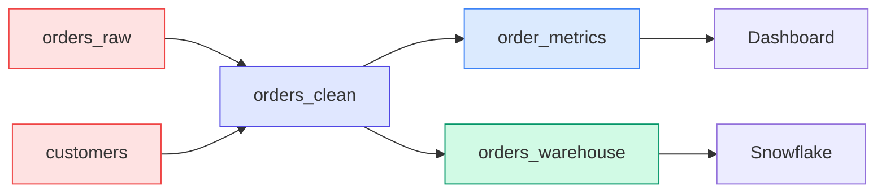
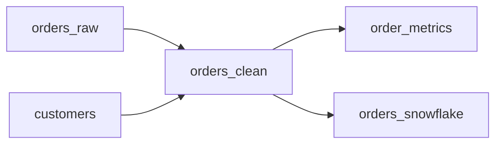

# DAG & Lineage

streamt automatically builds a Directed Acyclic Graph (DAG) from your SQL references. This enables lineage visualization, impact analysis, and correct compilation order.

## What is the DAG?

The **DAG** (Directed Acyclic Graph) represents dependencies between:

- Sources → Models
- Models → Models
- Models → Exposures



## Automatic Dependency Detection

Dependencies are extracted from your SQL:

```yaml
models:
  - name: enriched_orders
    sql: |
      SELECT o.*, c.name, c.tier
      FROM {{ ref("orders_clean") }} o      -- Dependency
      JOIN {{ source("customers") }} c      -- Dependency
      ON o.customer_id = c.id
```

streamt parses `{{ ref() }}` and `{{ source() }}` calls to build the graph.

## Viewing Lineage

### ASCII Output

```bash
$ streamt lineage

orders_raw (source)
    └── orders_clean (topic)
            ├── order_metrics (flink)
            │       └── ops_dashboard (exposure)
            ├── orders_snowflake (sink)
            └── billing_service (exposure)

customers (source)
    └── orders_clean (topic)
            └── ...
```

### JSON Output

```bash
$ streamt lineage --format json
```

```json
{
  "nodes": [
    {"id": "source.orders_raw", "type": "source"},
    {"id": "model.orders_clean", "type": "model"},
    {"id": "model.order_metrics", "type": "model"},
    {"id": "exposure.ops_dashboard", "type": "exposure"}
  ],
  "edges": [
    {"from": "source.orders_raw", "to": "model.orders_clean"},
    {"from": "model.orders_clean", "to": "model.order_metrics"},
    {"from": "model.order_metrics", "to": "exposure.ops_dashboard"}
  ]
}
```

### Focus on a Model

```bash
# Show only dependencies of a specific model
$ streamt lineage --model order_metrics
```

### Upstream Only

```bash
# What does this model depend on?
$ streamt lineage --model order_metrics --upstream

orders_raw (source)
    └── orders_clean (topic)
            └── order_metrics (flink) ← YOU ARE HERE
```

### Downstream Only

```bash
# What depends on this model?
$ streamt lineage --model orders_clean --downstream

orders_clean (topic) ← YOU ARE HERE
    ├── order_metrics (flink)
    │       └── ops_dashboard (exposure)
    ├── orders_snowflake (sink)
    └── billing_service (exposure)
```

## Use Cases

### 1. Impact Analysis

Before changing a model, see what's affected:

```bash
$ streamt lineage --model orders_clean --downstream

⚠️  Changes to orders_clean will affect:
  - 2 models: order_metrics, orders_snowflake
  - 2 exposures: ops_dashboard, billing_service
```

### 2. Debug Data Issues

Trace back to find the source of bad data:

```bash
$ streamt lineage --model order_metrics --upstream

# Shows: orders_raw → orders_clean → order_metrics
# Issue might be in orders_raw or orders_clean transformation
```

### 3. Compilation Order

streamt compiles models in topological order:

```
1. orders_raw (source - already exists)
2. customers (source - already exists)
3. orders_clean (depends on sources only)
4. order_metrics (depends on orders_clean)
5. customer_orders (depends on orders_clean + customers)
```

### 4. Deployment Planning

Deploy in correct order:

```bash
$ streamt plan

Deployment order:
1. Create topic: orders.clean.v1
2. Deploy Flink job: order_metrics
3. Create connector: orders_snowflake
```

## Cycle Detection

streamt prevents circular dependencies:

```yaml
# This will fail validation
models:
  - name: model_a
    sql: SELECT * FROM {{ ref("model_b") }}

  - name: model_b
    sql: SELECT * FROM {{ ref("model_a") }}  # Cycle!
```

```bash
$ streamt validate

✗ Circular dependency detected: model_a → model_b → model_a
```

## DAG Visualization

### Mermaid Diagram

Generate a Mermaid diagram:

```bash
$ streamt lineage --format mermaid
```



### Generated Documentation

The `streamt docs generate` command creates HTML with interactive lineage diagrams.

## Complex DAG Patterns

### Fan-Out

One source feeds multiple models:

```
orders_raw
    ├── orders_us
    ├── orders_eu
    └── orders_apac
```

### Fan-In

Multiple sources combine into one model:

```
users ──────┐
products ───┼── recommendations
orders ─────┘
```

### Diamond

A "diamond" dependency pattern:

```
     orders_raw
      /      \
orders_us   orders_eu
      \      /
   global_metrics
```

### Deep Pipeline

Multi-stage transformation:

```
raw → clean → enriched → aggregated → exported
```

## Best Practices

### 1. Keep the DAG Shallow

```yaml
# Prefer: 2-3 levels deep
raw → clean → metrics

# Avoid: 10+ levels deep
raw → v1 → v2 → v3 → ... → v10
```

### 2. Name for Clarity

```yaml
# Good: Clear lineage from names
orders_raw → orders_clean → orders_metrics → orders_dashboard

# Bad: Unclear relationships
data1 → transformed → final
```

### 3. Document at Boundaries

Add descriptions at source entry and exposure exit:

```yaml
sources:
  - name: orders_raw
    description: Entry point for order data

exposures:
  - name: ops_dashboard
    description: Final consumption point
```

### 4. Use Tags for Grouping

```yaml
models:
  - name: orders_clean
    tags: [orders, tier-1, critical]

# Then filter lineage
$ streamt lineage --tag critical
```

### 5. Review Before Changes

Always check downstream impact:

```bash
# Before modifying orders_clean
$ streamt lineage --model orders_clean --downstream

# Notify affected teams if needed
```

## Programmatic Access

Access the DAG from the compiled manifest:

```python
import json

with open("generated/manifest.json") as f:
    manifest = json.load(f)

# Get all edges
for edge in manifest["dag"]["edges"]:
    print(f"{edge['from']} → {edge['to']}")

# Find downstream of a model
def get_downstream(model_name):
    return [
        edge["to"]
        for edge in manifest["dag"]["edges"]
        if edge["from"] == f"model.{model_name}"
    ]
```

## Integration with Tools

### CI/CD Impact Check

```bash
# In CI, check if critical exposures are affected
affected=$(streamt lineage --model $CHANGED_MODEL --downstream --format json | \
           jq '.nodes[] | select(.tags | contains(["critical"]))')

if [ -n "$affected" ]; then
  echo "⚠️ Critical systems affected - require approval"
  exit 1
fi
```

### Slack Notifications

```bash
# Notify teams about changes
downstream=$(streamt lineage --model orders_clean --downstream --format json)
teams=$(echo $downstream | jq -r '.nodes[].owner' | sort -u)

for team in $teams; do
  notify_slack "#$team" "Changes to orders_clean may affect your systems"
done
```

## Next Steps

- [CLI Reference](../reference/cli.md) — Lineage command options
- [Configuration](../reference/configuration.md) — Runtime settings
- [Examples](../examples/payments.md) — See DAGs in action
