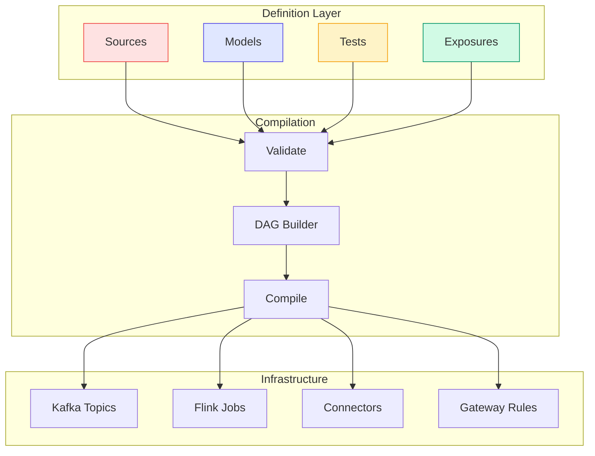

# Core Concepts

streamt is built around a few key abstractions that work together to define streaming pipelines. This page provides an overview of these concepts and how they relate to each other.

## The Big Picture



## Sources

**Sources** represent external data entry points — Kafka topics that are produced by other systems and consumed by your pipeline.

```yaml
sources:
  - name: user_events
    topic: events.users.v1
    description: User activity events from the web app
    owner: platform-team
```

Sources are **read-only** in streamt. You don't create or modify them; you declare that they exist and describe their schema and ownership.

[Learn more about Sources →](sources.md)

## Models

**Models** are transformations that produce new data streams. They're the core building blocks of your pipeline.

```yaml
models:
  - name: active_users
    materialized: flink
    sql: |
      SELECT user_id, COUNT(*) as event_count
      FROM {{ source("user_events") }}
      GROUP BY user_id, TUMBLE(event_time, INTERVAL '1' HOUR)
```

Models can reference sources with `{{ source("name") }}` or other models with `{{ ref("name") }}`. This creates a dependency graph (DAG) that streamt uses for compilation and deployment.

[Learn more about Models →](models.md)

## Materializations

**Materializations** define how a model is deployed to infrastructure. streamt supports four types:

| Materialization | Description | Use Case |
|-----------------|-------------|----------|
| `topic` | Creates a Kafka topic | Stateless transformations, filtering |
| `virtual_topic` | Gateway-backed view | Read-time filtering without storage |
| `flink` | Deploys a Flink job | Stateful processing, windowing, joins |
| `sink` | Creates a Kafka Connect connector | Export to external systems |

```yaml
# Stateless filtering → Kafka topic
- name: high_value_orders
  materialized: topic
  sql: SELECT * FROM {{ source("orders") }} WHERE amount > 1000

# Stateful aggregation → Flink job
- name: hourly_revenue
  materialized: flink
  sql: SELECT SUM(amount) FROM {{ ref("high_value_orders") }}
       GROUP BY TUMBLE(ts, INTERVAL '1' HOUR)

# Export to warehouse → Kafka Connect
- name: orders_warehouse
  materialized: sink
  from: high_value_orders
  connector:
    type: snowflake-sink
```

## Tests

**Tests** validate data quality and schema constraints. streamt supports three test types:

| Type | When | How |
|------|------|-----|
| `schema` | At compile time | Validates structure and constraints |
| `sample` | On demand | Consumes N messages, runs assertions |
| `continuous` | Always running | Flink job monitoring in real-time |

```yaml
tests:
  - name: orders_not_null
    model: orders_clean
    type: schema
    assertions:
      - not_null:
          columns: [order_id, customer_id]
```

[Learn more about Tests →](tests.md)

## Exposures

**Exposures** document downstream consumers of your data. They don't deploy anything but provide lineage and SLA documentation.

```yaml
exposures:
  - name: fraud_detection_service
    type: application
    role: consumer
    consumes:
      - ref: transactions_clean
    sla:
      latency_p99_ms: 100
```

[Learn more about Exposures →](exposures.md)

## The DAG

The **Directed Acyclic Graph (DAG)** represents dependencies between your sources, models, and exposures. streamt builds this automatically from your SQL references.

```
raw_events (source)
    ├── events_clean (topic)
    │       ├── hourly_stats (flink)
    │       │       └── dashboard (exposure)
    │       └── events_warehouse (sink)
    └── events_archive (sink)
```

The DAG is used for:

- **Compilation order** — Models are compiled in topological order
- **Impact analysis** — See what's affected by changes
- **Lineage visualization** — Understand data flow
- **Deployment planning** — Create resources in correct order

[Learn more about DAG & Lineage →](dag.md)

## Runtime Configuration

The `runtime` section configures connections to your infrastructure:

```yaml
runtime:
  kafka:
    bootstrap_servers: kafka:9092
    security_protocol: SASL_SSL

  schema_registry:
    url: http://schema-registry:8081

  flink:
    default: production
    clusters:
      production:
        type: rest
        rest_url: http://flink-jobmanager:8081

  connect:
    default: production
    clusters:
      production:
        rest_url: http://kafka-connect:8083

  # Required for virtual_topic materialization
  conduktor:
    gateway:
      admin_url: http://gateway:8888
      proxy_bootstrap: gateway:6969
```

See the [Gateway Guide](../guides/gateway.md) for virtual topic configuration details.

## Governance Rules

**Rules** enforce standards across your project:

```yaml
rules:
  topics:
    min_partitions: 6
    naming_pattern: "^[a-z]+\\.[a-z]+\\.v[0-9]+$"

  models:
    require_description: true
    require_owner: true
    require_tests: true
```

Rules are checked during `streamt validate` and can block deployment if violated.

[Learn more about Governance →](../reference/governance.md)

## Workflow

The typical streamt workflow is:

1. **Define** — Write sources, models, tests, exposures in YAML
2. **Validate** — `streamt validate` checks syntax and rules
3. **Plan** — `streamt plan` shows what will change
4. **Apply** — `streamt apply` deploys to infrastructure
5. **Test** — `streamt test` validates data quality
6. **Monitor** — `streamt status` checks health

```bash
# Development workflow
streamt validate        # Check configuration
streamt lineage         # Visualize dependencies
streamt plan            # See what will change
streamt apply           # Deploy changes
streamt test            # Validate data quality
```

## Comparison with dbt

If you're familiar with dbt, here's how concepts map:

| dbt | streamt | Notes |
|-----|---------|-------|
| Source | Source | Both declare external data |
| Model | Model | Both transform data |
| Materialization | Materialization | Different options (table vs topic) |
| Test | Test | Similar assertion syntax |
| Exposure | Exposure | Same concept |
| `ref()` | `ref()` | Same function |
| `source()` | `source()` | Same function |

Key differences:

- **Streaming vs Batch** — streamt handles continuous data flows
- **Infrastructure** — Kafka/Flink/Connect vs SQL warehouse
- **Real-time tests** — Continuous monitoring, not just batch tests

## Next Steps

- [Sources](sources.md) — Deep dive into source definitions
- [Models](models.md) — Understanding model types and SQL
- [Tests](tests.md) — Data quality and assertions
- [Exposures](exposures.md) — Documenting consumers
