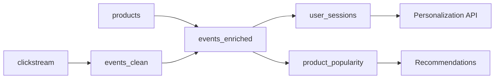

# E-commerce Events

Track user behavior in real-time for personalization, recommendations, and analytics.

## Architecture



## Use Cases

- **Session Analytics**: Track user journeys in real-time
- **Product Popularity**: Real-time trending products
- **Personalization**: Feed ML models with user behavior
- **A/B Testing**: Measure feature impact live

## Sources

```yaml title="sources/events.yml"
sources:
  - name: clickstream
    topic: ecom.clickstream.v1
    description: Raw user interaction events from web/mobile
    owner: frontend-team
    freshness:
      warn_after: 30s
      error_after: 2m
    columns:
      - name: event_id
        description: Unique event identifier
      - name: session_id
        description: User session identifier
      - name: user_id
        description: Authenticated user ID (nullable)
        classification: internal
      - name: anonymous_id
        description: Anonymous tracking ID
        classification: internal
      - name: event_type
        description: Event type (page_view, click, add_to_cart, purchase)
      - name: page_url
        description: Current page URL
      - name: referrer_url
        description: Referring URL
      - name: product_id
        description: Product ID (if applicable)
      - name: search_query
        description: Search query (if applicable)
      - name: device_type
        description: Device type (desktop, mobile, tablet)
      - name: browser
        description: Browser name
      - name: country
        description: User country (from IP)
      - name: timestamp
        description: Event timestamp

  - name: products
    topic: ecom.products.v1
    description: Product catalog for enrichment
    owner: catalog-team
    columns:
      - name: product_id
      - name: name
      - name: category
      - name: subcategory
      - name: price
      - name: brand
```

## Models

### Clean Events

```yaml title="models/events_clean.yml"
models:
  - name: events_clean
    materialized: topic
    description: Cleaned and validated user events
    owner: data-platform

    topic:
      name: ecom.events-clean.v1
      partitions: 24

    key: session_id

    sql: |
      SELECT
        event_id,
        session_id,
        COALESCE(user_id, anonymous_id) as user_identifier,
        user_id,
        anonymous_id,
        event_type,
        page_url,
        referrer_url,
        product_id,
        search_query,
        device_type,
        browser,
        country,
        `timestamp`
      FROM {{ source("clickstream") }}
      WHERE event_id IS NOT NULL
        AND session_id IS NOT NULL
        AND event_type IN ('page_view', 'click', 'add_to_cart', 'remove_from_cart', 'purchase', 'search')
```

### Enrich with Product Data

```yaml title="models/events_enriched.yml"
models:
  - name: events_enriched
    materialized: flink
    description: Events enriched with product details
    owner: data-platform

    flink:
      parallelism: 8

    topic:
      name: ecom.events-enriched.v1
      partitions: 24

    key: session_id

    sql: |
      SELECT
        e.event_id,
        e.session_id,
        e.user_identifier,
        e.user_id,
        e.event_type,
        e.page_url,
        e.product_id,
        e.search_query,
        e.device_type,
        e.country,
        e.`timestamp`,
        p.name as product_name,
        p.category as product_category,
        p.subcategory as product_subcategory,
        p.price as product_price,
        p.brand as product_brand
      FROM {{ ref("events_clean") }} e
      LEFT JOIN {{ source("products") }} FOR SYSTEM_TIME AS OF e.`timestamp` AS p
        ON e.product_id = p.product_id
```

### User Sessions

```yaml title="models/user_sessions.yml"
models:
  - name: user_sessions
    materialized: flink
    description: |
      Aggregated user sessions with behavior metrics.
      Sessions are 30-minute tumbling windows.
    owner: analytics-team

    flink:
      parallelism: 8
      checkpoint_interval: 60000

    topic:
      name: ecom.user-sessions.v1
      partitions: 12

    key: session_id

    sql: |
      SELECT
        session_id,
        user_identifier,
        device_type,
        country,
        TUMBLE_START(`timestamp`, INTERVAL '30' MINUTE) as session_start,
        TUMBLE_END(`timestamp`, INTERVAL '30' MINUTE) as session_end,
        COUNT(*) as event_count,
        COUNT(DISTINCT page_url) as pages_viewed,
        SUM(CASE WHEN event_type = 'page_view' THEN 1 ELSE 0 END) as page_views,
        SUM(CASE WHEN event_type = 'click' THEN 1 ELSE 0 END) as clicks,
        SUM(CASE WHEN event_type = 'add_to_cart' THEN 1 ELSE 0 END) as add_to_carts,
        SUM(CASE WHEN event_type = 'purchase' THEN 1 ELSE 0 END) as purchases,
        SUM(CASE WHEN event_type = 'search' THEN 1 ELSE 0 END) as searches,
        COLLECT(DISTINCT product_category) as categories_browsed,
        MAX(product_price) as max_product_price,
        AVG(product_price) as avg_product_price
      FROM {{ ref("events_enriched") }}
      GROUP BY
        session_id,
        user_identifier,
        device_type,
        country,
        TUMBLE(`timestamp`, INTERVAL '30' MINUTE)
```

### Product Popularity

```yaml title="models/product_popularity.yml"
models:
  - name: product_popularity
    materialized: flink
    description: |
      Real-time product popularity scores.
      Updated every 5 minutes based on user interactions.
    owner: recommendations-team

    flink:
      parallelism: 4
      checkpoint_interval: 30000

    topic:
      name: ecom.product-popularity.v1
      partitions: 6

    key: product_id

    sql: |
      SELECT
        product_id,
        product_name,
        product_category,
        TUMBLE_START(`timestamp`, INTERVAL '5' MINUTE) as window_start,
        TUMBLE_END(`timestamp`, INTERVAL '5' MINUTE) as window_end,
        COUNT(*) as total_interactions,
        SUM(CASE WHEN event_type = 'page_view' THEN 1 ELSE 0 END) as views,
        SUM(CASE WHEN event_type = 'add_to_cart' THEN 1 ELSE 0 END) as add_to_carts,
        SUM(CASE WHEN event_type = 'purchase' THEN 1 ELSE 0 END) as purchases,
        COUNT(DISTINCT user_identifier) as unique_users,
        -- Popularity score: weighted sum
        (
          SUM(CASE WHEN event_type = 'page_view' THEN 1 ELSE 0 END) * 1 +
          SUM(CASE WHEN event_type = 'add_to_cart' THEN 5 ELSE 0 END) +
          SUM(CASE WHEN event_type = 'purchase' THEN 10 ELSE 0 END)
        ) as popularity_score
      FROM {{ ref("events_enriched") }}
      WHERE product_id IS NOT NULL
      GROUP BY
        product_id,
        product_name,
        product_category,
        TUMBLE(`timestamp`, INTERVAL '5' MINUTE)
```

## Tests

```yaml title="tests/events_tests.yml"
tests:
  - name: events_schema
    model: events_clean
    type: schema
    assertions:
      - not_null:
          columns: [event_id, session_id, event_type]
      - accepted_values:
          column: event_type
          values: [page_view, click, add_to_cart, remove_from_cart, purchase, search]
      - accepted_values:
          column: device_type
          values: [desktop, mobile, tablet]

  - name: sessions_quality
    model: user_sessions
    type: sample
    sample_size: 1000
    assertions:
      - range:
          column: event_count
          min: 1
          max: 10000

  - name: events_freshness
    model: events_clean
    type: continuous
    assertions:
      - max_lag:
          seconds: 30
      - throughput:
          min_per_minute: 1000
    on_failure:
      - alert:
          channel: slack
          webhook: ${SLACK_WEBHOOK}
```

## Exposures

```yaml title="exposures/services.yml"
exposures:
  - name: personalization_api
    type: api
    description: Serves personalized content based on user behavior
    owner: personalization-team
    role: consumer
    consumer_group: personalization-cg
    consumes:
      - ref: user_sessions
    sla:
      latency_p99_ms: 50
      availability: 99.95

  - name: recommendation_service
    type: ml_inference
    description: Real-time product recommendations
    owner: ml-team
    role: consumer
    consumer_group: recommendations-cg
    consumes:
      - ref: product_popularity
      - ref: user_sessions
    sla:
      latency_p99_ms: 100
```
