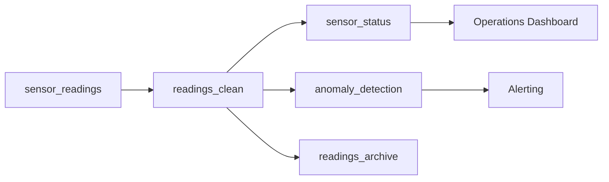

# IoT Sensors

Process industrial sensor data for real-time monitoring, anomaly detection, and predictive maintenance.

## Architecture



## Use Cases

- **Real-time Monitoring**: Track sensor health across facilities
- **Anomaly Detection**: Identify outliers in sensor readings
- **Predictive Maintenance**: Feed ML models for failure prediction
- **Historical Analysis**: Archive data for long-term trends

## Configuration

```yaml title="stream_project.yml"
project:
  name: iot-sensors
  version: "1.0.0"
  description: Industrial IoT sensor monitoring pipeline

runtime:
  kafka:
    bootstrap_servers: ${KAFKA_BROKERS}
  flink:
    default: edge
    clusters:
      edge:
        type: rest
        rest_url: ${FLINK_EDGE_URL}
        sql_gateway_url: ${FLINK_EDGE_SQL_URL}
      cloud:
        type: rest
        rest_url: ${FLINK_CLOUD_URL}
        sql_gateway_url: ${FLINK_CLOUD_SQL_URL}
  connect:
    default: cloud
    clusters:
      cloud:
        rest_url: ${CONNECT_URL}

rules:
  topics:
    min_partitions: 12  # High partition count for IoT scale
  models:
    require_description: true
```

## Sources

```yaml title="sources/sensors.yml"
sources:
  - name: sensor_readings
    topic: iot.sensors.readings.v1
    description: |
      Raw sensor readings from industrial equipment.
      High volume: ~100K messages/second.
    owner: iot-platform
    freshness:
      warn_after: 10s
      error_after: 30s
    columns:
      - name: reading_id
        description: Unique reading identifier
      - name: sensor_id
        description: Sensor device identifier
      - name: device_type
        description: Type of sensor (temperature, pressure, vibration, humidity)
      - name: facility_id
        description: Facility location identifier
      - name: zone
        description: Zone within facility
      - name: value
        description: Sensor reading value
      - name: unit
        description: Measurement unit (celsius, psi, hz, percent)
      - name: quality
        description: Reading quality indicator (0-100)
      - name: timestamp
        description: Reading timestamp (millisecond precision)

  - name: sensor_metadata
    topic: iot.sensors.metadata.v1
    description: Sensor configuration and thresholds
    owner: iot-platform
    columns:
      - name: sensor_id
      - name: device_type
      - name: min_threshold
      - name: max_threshold
      - name: critical_min
      - name: critical_max
      - name: maintenance_schedule
```

## Models

### Clean Readings

```yaml title="models/readings_clean.yml"
models:
  - name: readings_clean
    materialized: topic
    description: |
      Validated sensor readings with quality filtering.
      Removes readings with quality < 50.
    owner: iot-platform
    tags: [iot, tier-1]

    topic:
      name: iot.readings-clean.v1
      partitions: 48  # High partition count
      config:
        retention.ms: 86400000  # 1 day

    key: sensor_id

    sql: |
      SELECT
        reading_id,
        sensor_id,
        device_type,
        facility_id,
        zone,
        value,
        unit,
        quality,
        `timestamp`
      FROM {{ source("sensor_readings") }}
      WHERE reading_id IS NOT NULL
        AND sensor_id IS NOT NULL
        AND quality >= 50
        AND value IS NOT NULL
```

### Sensor Status (Windowed)

```yaml title="models/sensor_status.yml"
models:
  - name: sensor_status
    materialized: flink
    description: |
      Aggregated sensor status per minute.
      Shows health metrics for each sensor.
    owner: operations-team
    tags: [iot, monitoring]

    flink:
      parallelism: 16
      checkpoint_interval: 30000
      cluster: edge

    topic:
      name: iot.sensor-status.v1
      partitions: 24

    key: sensor_id

    sql: |
      SELECT
        sensor_id,
        device_type,
        facility_id,
        zone,
        TUMBLE_START(`timestamp`, INTERVAL '1' MINUTE) as window_start,
        TUMBLE_END(`timestamp`, INTERVAL '1' MINUTE) as window_end,
        COUNT(*) as reading_count,
        AVG(value) as avg_value,
        MIN(value) as min_value,
        MAX(value) as max_value,
        STDDEV_POP(value) as stddev_value,
        AVG(quality) as avg_quality,
        CASE
          WHEN COUNT(*) < 10 THEN 'LOW_FREQUENCY'
          WHEN AVG(quality) < 70 THEN 'DEGRADED'
          ELSE 'HEALTHY'
        END as health_status
      FROM {{ ref("readings_clean") }}
      GROUP BY
        sensor_id,
        device_type,
        facility_id,
        zone,
        TUMBLE(`timestamp`, INTERVAL '1' MINUTE)
```

### Anomaly Detection

```yaml title="models/anomaly_detection.yml"
models:
  - name: anomaly_detection
    materialized: flink
    description: |
      Real-time anomaly detection using threshold comparison.
      Compares readings against sensor-specific thresholds.
    owner: reliability-team
    tags: [iot, alerts, tier-1]

    flink:
      parallelism: 16
      checkpoint_interval: 10000
      cluster: edge

    topic:
      name: iot.anomalies.v1
      partitions: 12

    key: sensor_id

    sql: |
      SELECT
        r.reading_id,
        r.sensor_id,
        r.device_type,
        r.facility_id,
        r.zone,
        r.value,
        r.unit,
        r.`timestamp`,
        m.min_threshold,
        m.max_threshold,
        m.critical_min,
        m.critical_max,
        CASE
          WHEN r.value < m.critical_min OR r.value > m.critical_max THEN 'CRITICAL'
          WHEN r.value < m.min_threshold OR r.value > m.max_threshold THEN 'WARNING'
          ELSE 'NORMAL'
        END as anomaly_level,
        CASE
          WHEN r.value < m.critical_min THEN 'BELOW_CRITICAL_MIN'
          WHEN r.value > m.critical_max THEN 'ABOVE_CRITICAL_MAX'
          WHEN r.value < m.min_threshold THEN 'BELOW_MIN'
          WHEN r.value > m.max_threshold THEN 'ABOVE_MAX'
          ELSE 'IN_RANGE'
        END as anomaly_type,
        ABS(
          CASE
            WHEN r.value < m.min_threshold THEN (m.min_threshold - r.value) / m.min_threshold
            WHEN r.value > m.max_threshold THEN (r.value - m.max_threshold) / m.max_threshold
            ELSE 0
          END
        ) * 100 as deviation_percent
      FROM {{ ref("readings_clean") }} r
      JOIN {{ source("sensor_metadata") }} FOR SYSTEM_TIME AS OF r.`timestamp` AS m
        ON r.sensor_id = m.sensor_id
      WHERE r.value < m.min_threshold
         OR r.value > m.max_threshold
```

### Facility Aggregates

```yaml title="models/facility_metrics.yml"
models:
  - name: facility_metrics
    materialized: flink
    description: Facility-level aggregations for executive dashboards
    owner: analytics-team
    tags: [iot, analytics]

    flink:
      parallelism: 4
      checkpoint_interval: 60000
      cluster: cloud

    topic:
      name: iot.facility-metrics.v1
      partitions: 6

    key: facility_id

    sql: |
      SELECT
        facility_id,
        TUMBLE_START(`timestamp`, INTERVAL '5' MINUTE) as window_start,
        TUMBLE_END(`timestamp`, INTERVAL '5' MINUTE) as window_end,
        COUNT(DISTINCT sensor_id) as active_sensors,
        COUNT(*) as total_readings,
        AVG(value) as avg_reading,
        SUM(CASE WHEN quality < 70 THEN 1 ELSE 0 END) as degraded_readings,
        SUM(CASE WHEN device_type = 'temperature' THEN value ELSE 0 END) /
          NULLIF(SUM(CASE WHEN device_type = 'temperature' THEN 1 ELSE 0 END), 0) as avg_temperature,
        SUM(CASE WHEN device_type = 'pressure' THEN value ELSE 0 END) /
          NULLIF(SUM(CASE WHEN device_type = 'pressure' THEN 1 ELSE 0 END), 0) as avg_pressure
      FROM {{ ref("readings_clean") }}
      GROUP BY
        facility_id,
        TUMBLE(`timestamp`, INTERVAL '5' MINUTE)
```

### Archive to S3

```yaml title="models/readings_archive.yml"
models:
  - name: readings_archive
    materialized: sink
    description: Archive sensor readings to S3 for long-term analysis
    owner: data-platform
    tags: [archive, s3]

    from: readings_clean

    connector:
      type: s3-sink
      tasks_max: 8
      config:
        s3.bucket.name: ${S3_BUCKET}
        s3.region: ${AWS_REGION}
        aws.access.key.id: ${AWS_ACCESS_KEY}
        aws.secret.access.key: ${AWS_SECRET_KEY}
        topics.dir: iot/readings
        flush.size: 100000
        rotate.interval.ms: 300000  # 5 minutes
        format.class: io.confluent.connect.s3.format.parquet.ParquetFormat
        partitioner.class: io.confluent.connect.storage.partitioner.TimeBasedPartitioner
        path.format: "'year'=YYYY/'month'=MM/'day'=dd/'hour'=HH"
        partition.duration.ms: 3600000
        timestamp.extractor: RecordField
        timestamp.field: timestamp
```

## Tests

```yaml title="tests/iot_tests.yml"
tests:
  - name: readings_schema
    model: readings_clean
    type: schema
    assertions:
      - not_null:
          columns: [reading_id, sensor_id, device_type, value]
      - accepted_values:
          column: device_type
          values: [temperature, pressure, vibration, humidity, flow, level]
      - range:
          column: quality
          min: 50
          max: 100

  - name: readings_quality
    model: readings_clean
    type: sample
    sample_size: 10000
    assertions:
      - unique_key:
          key: reading_id
          tolerance: 0.0001

  - name: iot_pipeline_health
    model: readings_clean
    type: continuous
    assertions:
      - max_lag:
          seconds: 10  # Very low latency requirement
      - throughput:
          min_per_minute: 6000000  # 100K/second
    on_failure:
      - alert:
          channel: pagerduty
          routing_key: ${PAGERDUTY_IOT_KEY}
          severity: critical
          message: "IoT pipeline degradation - potential sensor data loss"

  - name: anomaly_alerting
    model: anomaly_detection
    type: continuous
    assertions:
      - throughput:
          max_per_minute: 10000  # Alert if too many anomalies
    on_failure:
      - alert:
          channel: slack
          webhook: ${SLACK_IOT_ALERTS}
          message: "High anomaly rate detected - check equipment"
```

## Exposures

```yaml title="exposures/systems.yml"
exposures:
  - name: scada_system
    type: application
    description: SCADA system for real-time facility monitoring
    owner: operations-team
    role: consumer
    consumer_group: scada-cg
    consumes:
      - ref: sensor_status
      - ref: anomaly_detection
    sla:
      latency_p99_ms: 100
      availability: 99.99

  - name: predictive_maintenance
    type: ml_inference
    description: ML model predicting equipment failures
    owner: reliability-team
    role: consumer
    consumer_group: predictive-maint-cg
    consumes:
      - ref: sensor_status
    sla:
      latency_p99_ms: 500

  - name: ops_dashboard
    type: dashboard
    description: Real-time operations dashboard
    owner: operations-team
    url: https://grafana.company.com/iot
    role: consumer
    consumer_group: grafana-iot
    consumes:
      - ref: facility_metrics
```

## Scaling Considerations

For high-volume IoT workloads:

1. **Partitioning**: Use sensor_id as key for locality
2. **Parallelism**: Match Flink parallelism to partition count
3. **Edge Processing**: Process at edge, aggregate in cloud
4. **Retention**: Short retention for raw data, longer for aggregates
5. **Compression**: Enable compression for storage efficiency
