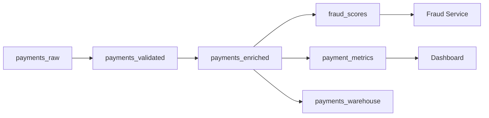

# Payments Pipeline

A complete example of real-time payment processing with fraud detection, validation, and analytics.

## Architecture



## Project Structure

```
payments-pipeline/
├── stream_project.yml
├── sources/
│   ├── payments.yml
│   └── customers.yml
├── models/
│   ├── payments_validated.yml
│   ├── payments_enriched.yml
│   ├── fraud_scores.yml
│   ├── payment_metrics.yml
│   └── payments_warehouse.yml
├── tests/
│   └── payments_tests.yml
└── exposures/
    └── services.yml
```

## Configuration

```yaml title="stream_project.yml"
project:
  name: payments-pipeline
  version: "1.0.0"
  description: Real-time payment processing with fraud detection

runtime:
  kafka:
    bootstrap_servers: ${KAFKA_BROKERS}
    security_protocol: SASL_SSL
    sasl_mechanism: PLAIN
    sasl_username: ${KAFKA_USER}
    sasl_password: ${KAFKA_PASSWORD}

  schema_registry:
    url: ${SCHEMA_REGISTRY_URL}

  flink:
    default: production
    clusters:
      production:
        type: rest
        rest_url: ${FLINK_REST_URL}
        sql_gateway_url: ${FLINK_SQL_GATEWAY_URL}

  connect:
    default: production
    clusters:
      production:
        rest_url: ${CONNECT_URL}

rules:
  topics:
    min_partitions: 6
    naming_pattern: "^payments\\.[a-z-]+\\.v[0-9]+$"
  models:
    require_description: true
    require_owner: true
    require_tests: true
  security:
    require_classification: true
    sensitive_columns_require_masking: true
```

## Sources

```yaml title="sources/payments.yml"
sources:
  - name: payments_raw
    topic: payments.raw.v1
    description: |
      Raw payment events from the checkout service.
      Contains all payment attempts including failed ones.
    owner: checkout-team
    freshness:
      warn_after: 1m
      error_after: 5m
    schema:
      registry: confluent
      subject: payments-raw-value
    columns:
      - name: payment_id
        description: Unique payment identifier (UUID)
      - name: customer_id
        description: Customer identifier
        classification: internal
      - name: amount
        description: Payment amount in cents
        classification: internal
      - name: currency
        description: ISO 4217 currency code
      - name: card_last_four
        description: Last 4 digits of card
        classification: sensitive
      - name: card_brand
        description: Card brand (visa, mastercard, etc.)
      - name: status
        description: Payment status
      - name: merchant_id
        description: Merchant identifier
      - name: ip_address
        description: Customer IP address
        classification: sensitive
      - name: device_fingerprint
        description: Device fingerprint hash
        classification: internal
      - name: created_at
        description: Payment timestamp
```

```yaml title="sources/customers.yml"
sources:
  - name: customers
    topic: customers.profiles.v1
    description: Customer profile data for enrichment
    owner: identity-team
    columns:
      - name: customer_id
        description: Customer identifier
      - name: tier
        description: Customer tier (bronze, silver, gold, platinum)
      - name: country
        description: Customer country code
      - name: created_at
        description: Account creation date
```

## Models

### 1. Validate Payments

```yaml title="models/payments_validated.yml"
models:
  - name: payments_validated
    materialized: topic
    description: |
      Validated payments with basic data quality checks.
      Filters out malformed or clearly invalid payments.
    owner: payments-team
    tags: [payments, tier-1]

    topic:
      name: payments.validated.v1
      partitions: 12
      config:
        retention.ms: 604800000

    key: payment_id

    sql: |
      SELECT
        payment_id,
        customer_id,
        amount,
        UPPER(currency) as currency,
        card_last_four,
        card_brand,
        status,
        merchant_id,
        ip_address,
        device_fingerprint,
        created_at
      FROM {{ source("payments_raw") }}
      WHERE payment_id IS NOT NULL
        AND customer_id IS NOT NULL
        AND amount > 0
        AND amount < 10000000  -- Max $100,000
        AND currency IN ('USD', 'EUR', 'GBP', 'JPY', 'CAD')
        AND status IN ('pending', 'processing', 'completed', 'failed', 'refunded')
```

### 2. Enrich with Customer Data

```yaml title="models/payments_enriched.yml"
models:
  - name: payments_enriched
    materialized: flink
    description: |
      Payments enriched with customer tier and country.
      Used for fraud scoring and analytics.
    owner: payments-team
    tags: [payments, tier-1]

    flink:
      parallelism: 8
      checkpoint_interval: 30000

    topic:
      name: payments.enriched.v1
      partitions: 12

    key: payment_id

    sql: |
      SELECT
        p.payment_id,
        p.customer_id,
        p.amount,
        p.currency,
        p.card_last_four,
        p.card_brand,
        p.status,
        p.merchant_id,
        p.ip_address,
        p.device_fingerprint,
        p.created_at,
        c.tier as customer_tier,
        c.country as customer_country,
        CASE
          WHEN c.tier = 'platinum' THEN 0.5
          WHEN c.tier = 'gold' THEN 0.7
          WHEN c.tier = 'silver' THEN 0.9
          ELSE 1.0
        END as risk_multiplier
      FROM {{ ref("payments_validated") }} p
      LEFT JOIN {{ source("customers") }} FOR SYSTEM_TIME AS OF p.created_at AS c
        ON p.customer_id = c.customer_id
```

### 3. Fraud Scoring

```yaml title="models/fraud_scores.yml"
models:
  - name: fraud_scores
    materialized: flink
    description: |
      Real-time fraud risk scores for each payment.
      Scores range from 0 (low risk) to 100 (high risk).
    owner: fraud-team
    tags: [fraud, ml, tier-1]

    flink:
      parallelism: 8
      checkpoint_interval: 10000

    topic:
      name: payments.fraud-scores.v1
      partitions: 12

    key: payment_id

    security:
      masking:
        - column: ip_address
          policy: hash
        - column: card_last_four
          policy: redact

    sql: |
      SELECT
        payment_id,
        customer_id,
        amount,
        currency,
        card_last_four,
        ip_address,
        created_at,
        customer_tier,
        customer_country,

        -- Calculate fraud score components
        CASE
          WHEN amount > 500000 THEN 30  -- High amount
          WHEN amount > 100000 THEN 20
          WHEN amount > 50000 THEN 10
          ELSE 0
        END +
        CASE
          WHEN customer_tier IS NULL THEN 25  -- Unknown customer
          WHEN customer_tier = 'bronze' THEN 10
          ELSE 0
        END +
        CASE
          WHEN customer_country NOT IN ('US', 'CA', 'GB', 'DE', 'FR') THEN 15
          ELSE 0
        END as fraud_score,

        CASE
          WHEN (
            CASE WHEN amount > 500000 THEN 30 ELSE 0 END +
            CASE WHEN customer_tier IS NULL THEN 25 ELSE 0 END
          ) > 40 THEN 'HIGH'
          WHEN (
            CASE WHEN amount > 100000 THEN 20 ELSE 0 END +
            CASE WHEN customer_tier = 'bronze' THEN 10 ELSE 0 END
          ) > 20 THEN 'MEDIUM'
          ELSE 'LOW'
        END as risk_level

      FROM {{ ref("payments_enriched") }}
```

### 4. Payment Metrics

```yaml title="models/payment_metrics.yml"
models:
  - name: payment_metrics
    materialized: flink
    description: |
      Aggregated payment metrics by 5-minute windows.
      Used for real-time dashboards and alerting.
    owner: analytics-team
    tags: [analytics, metrics]

    flink:
      parallelism: 4
      checkpoint_interval: 60000

    topic:
      name: payments.metrics.v1
      partitions: 6

    sql: |
      SELECT
        TUMBLE_START(created_at, INTERVAL '5' MINUTE) as window_start,
        TUMBLE_END(created_at, INTERVAL '5' MINUTE) as window_end,
        currency,
        customer_country,
        COUNT(*) as payment_count,
        SUM(amount) as total_amount,
        AVG(amount) as avg_amount,
        COUNT(DISTINCT customer_id) as unique_customers,
        SUM(CASE WHEN status = 'completed' THEN 1 ELSE 0 END) as completed_count,
        SUM(CASE WHEN status = 'failed' THEN 1 ELSE 0 END) as failed_count
      FROM {{ ref("payments_enriched") }}
      GROUP BY
        TUMBLE(created_at, INTERVAL '5' MINUTE),
        currency,
        customer_country
```

### 5. Export to Warehouse

```yaml title="models/payments_warehouse.yml"
models:
  - name: payments_warehouse
    materialized: sink
    description: |
      Exports enriched payments to Snowflake for
      historical analysis and reporting.
    owner: data-platform
    tags: [warehouse, analytics]

    from: payments_enriched

    connector:
      type: snowflake-sink
      tasks_max: 4
      config:
        snowflake.url.name: ${SNOWFLAKE_URL}
        snowflake.user.name: ${SNOWFLAKE_USER}
        snowflake.private.key: ${SNOWFLAKE_KEY}
        snowflake.database.name: ANALYTICS
        snowflake.schema.name: PAYMENTS
        snowflake.table.name: PAYMENTS_STREAM
        key.converter: org.apache.kafka.connect.storage.StringConverter
        value.converter: io.confluent.connect.avro.AvroConverter
        value.converter.schema.registry.url: ${SCHEMA_REGISTRY_URL}
        buffer.count.records: 10000
        buffer.flush.time: 60
```

## Tests

```yaml title="tests/payments_tests.yml"
tests:
  # Schema validation
  - name: payments_validated_schema
    model: payments_validated
    type: schema
    assertions:
      - not_null:
          columns: [payment_id, customer_id, amount, currency, status]
      - accepted_values:
          column: currency
          values: [USD, EUR, GBP, JPY, CAD]
      - accepted_values:
          column: status
          values: [pending, processing, completed, failed, refunded]

  # Data quality sampling
  - name: payments_data_quality
    model: payments_validated
    type: sample
    sample_size: 5000
    assertions:
      - range:
          column: amount
          min: 1
          max: 10000000
      - unique_key:
          key: payment_id
          tolerance: 0.001

  # Fraud score validation
  - name: fraud_scores_validation
    model: fraud_scores
    type: sample
    sample_size: 1000
    assertions:
      - range:
          column: fraud_score
          min: 0
          max: 100
      - accepted_values:
          column: risk_level
          values: [LOW, MEDIUM, HIGH]

  # Continuous monitoring
  - name: payments_pipeline_health
    model: payments_validated
    type: continuous
    assertions:
      - max_lag:
          seconds: 60
      - throughput:
          min_per_minute: 100
    on_failure:
      - alert:
          channel: pagerduty
          routing_key: ${PAGERDUTY_KEY}
          severity: critical
```

## Exposures

```yaml title="exposures/services.yml"
exposures:
  - name: fraud_detection_service
    type: application
    description: |
      Real-time fraud detection service.
      Consumes fraud scores and blocks high-risk payments.
    owner: fraud-team
    url: https://wiki.company.com/fraud-service

    role: consumer
    consumer_group: fraud-detection-cg

    consumes:
      - ref: fraud_scores

    sla:
      latency_p99_ms: 100
      availability: 99.99
      throughput_per_second: 5000

  - name: payments_dashboard
    type: dashboard
    description: Real-time payments dashboard for operations
    owner: operations-team
    url: https://grafana.company.com/payments

    role: consumer
    consumer_group: grafana-payments

    consumes:
      - ref: payment_metrics

    sla:
      latency_p99_ms: 5000
      availability: 99.9
```

## Deployment

```bash
# Validate
streamt validate

# View lineage
streamt lineage

# Plan deployment
streamt plan

# Deploy
streamt apply

# Run tests
streamt test

# Check status
streamt status
```
