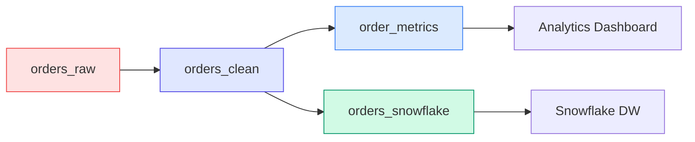

# Your First Pipeline

In this guide, you'll build a complete streaming pipeline that:

1. Reads raw order events from Kafka
2. Cleans and validates the data
3. Computes real-time aggregations with Flink
4. Exports results to an analytics sink

## Architecture Overview



## Setup

Make sure you have completed the [Quick Start](quickstart.md) and have the local infrastructure running.

Create a new project:

```bash
mkdir orders-pipeline
cd orders-pipeline
```

## Step 1: Project Configuration

```yaml title="stream_project.yml"
project:
  name: orders-pipeline
  version: "1.0.0"
  description: Real-time order processing pipeline

runtime:
  kafka:
    bootstrap_servers: localhost:9092

  schema_registry:
    url: http://localhost:8081

  flink:
    default: local
    clusters:
      local:
        type: rest
        rest_url: http://localhost:8082
        sql_gateway_url: http://localhost:8084

  connect:
    default: local
    clusters:
      local:
        rest_url: http://localhost:8083

# Governance rules
rules:
  topics:
    min_partitions: 3
    naming_pattern: "^orders\\.[a-z]+\\.v[0-9]+$"
  models:
    require_description: true
    require_owner: true
```

## Step 2: Define Sources

Create the source representing incoming orders:

```yaml title="sources/orders.yml"
sources:
  - name: orders_raw
    topic: orders.raw.v1
    description: |
      Raw order events from the checkout service.
      Contains all order attempts including failed ones.
    owner: checkout-team
    freshness:
      warn_after: 5m
      error_after: 15m

    schema:
      registry: confluent
      subject: orders-raw-value

    columns:
      - name: order_id
        description: Unique order identifier (UUID)
        tests:
          - not_null
          - unique

      - name: customer_id
        description: Customer who placed the order
        classification: internal

      - name: items
        description: Array of ordered items

      - name: total_amount
        description: Order total in cents
        classification: internal

      - name: currency
        description: ISO 4217 currency code

      - name: status
        description: Order status (pending, confirmed, shipped, delivered, cancelled)

      - name: created_at
        description: Order creation timestamp
```

## Step 3: Create Models

### 3a. Cleaned Orders (Topic Materialization)

A stateless transformation that filters and validates orders:

```yaml title="models/orders_clean.yml"
models:
  - name: orders_clean
    materialized: topic
    description: |
      Cleaned and validated orders.
      Filters out invalid orders and normalizes data.
    owner: data-platform

    topic:
      name: orders.clean.v1
      partitions: 12
      config:
        retention.ms: 604800000  # 7 days

    key: order_id

    sql: |
      SELECT
        order_id,
        customer_id,
        items,
        total_amount,
        UPPER(currency) as currency,
        status,
        created_at
      FROM {{ source("orders_raw") }}
      WHERE order_id IS NOT NULL
        AND customer_id IS NOT NULL
        AND total_amount > 0
        AND status IN ('pending', 'confirmed', 'shipped', 'delivered', 'cancelled')
```

### 3b. Order Metrics (Flink Materialization)

A stateful aggregation computing real-time metrics:

```yaml title="models/order_metrics.yml"
models:
  - name: order_metrics
    materialized: flink
    description: |
      Real-time order metrics aggregated by 5-minute windows.
      Used for operational dashboards.
    owner: analytics-team

    flink:
      parallelism: 4
      checkpoint_interval: 60000

    topic:
      name: orders.metrics.v1
      partitions: 6

    sql: |
      SELECT
        TUMBLE_START(created_at, INTERVAL '5' MINUTE) as window_start,
        TUMBLE_END(created_at, INTERVAL '5' MINUTE) as window_end,
        COUNT(*) as order_count,
        SUM(total_amount) as total_revenue,
        AVG(total_amount) as avg_order_value,
        COUNT(DISTINCT customer_id) as unique_customers
      FROM {{ ref("orders_clean") }}
      GROUP BY TUMBLE(created_at, INTERVAL '5' MINUTE)
```

### 3c. Snowflake Sink (Sink Materialization)

Export orders to Snowflake for analytics:

```yaml title="models/orders_snowflake.yml"
models:
  - name: orders_snowflake
    materialized: sink
    description: |
      Exports cleaned orders to Snowflake data warehouse
      for historical analysis and reporting.
    owner: data-platform

    from: orders_clean

    connector:
      type: snowflake-sink
      config:
        snowflake.url.name: ${SNOWFLAKE_URL}
        snowflake.user.name: ${SNOWFLAKE_USER}
        snowflake.private.key: ${SNOWFLAKE_PRIVATE_KEY}
        snowflake.database.name: ANALYTICS
        snowflake.schema.name: ORDERS
        snowflake.table.name: ORDERS_STREAM
        key.converter: org.apache.kafka.connect.storage.StringConverter
        value.converter: io.confluent.connect.avro.AvroConverter
        value.converter.schema.registry.url: http://localhost:8081
```

## Step 4: Add Tests

### Schema Tests

```yaml title="tests/orders_schema.yml"
tests:
  - name: orders_clean_schema
    model: orders_clean
    type: schema
    description: Validate orders_clean schema constraints

    assertions:
      - not_null:
          columns: [order_id, customer_id, total_amount, status]

      - accepted_values:
          column: status
          values: [pending, confirmed, shipped, delivered, cancelled]

      - accepted_values:
          column: currency
          values: [USD, EUR, GBP, JPY, CAD]
```

### Sample Tests

```yaml title="tests/orders_sample.yml"
tests:
  - name: orders_data_quality
    model: orders_clean
    type: sample
    sample_size: 1000
    description: Validate data quality on a sample of orders

    assertions:
      - range:
          column: total_amount
          min: 1
          max: 10000000  # Max $100,000

      - unique_key:
          key: order_id
          tolerance: 0.01  # Allow 1% duplicates in sample
```

### Continuous Tests

```yaml title="tests/orders_continuous.yml"
tests:
  - name: orders_freshness_monitor
    model: orders_clean
    type: continuous
    description: Continuously monitor order freshness

    assertions:
      - max_lag:
          seconds: 300  # Alert if lag > 5 minutes

      - throughput:
          min_per_minute: 10  # At least 10 orders/minute

    on_failure:
      - alert:
          channel: slack
          webhook: ${SLACK_WEBHOOK_URL}
```

## Step 5: Document Exposures

Document downstream consumers:

```yaml title="exposures/analytics.yml"
exposures:
  - name: operations_dashboard
    type: dashboard
    description: |
      Real-time operations dashboard showing order metrics,
      revenue trends, and system health.
    owner: analytics-team

    url: https://grafana.company.com/d/orders

    consumes:
      - ref: order_metrics

    sla:
      latency_p99_ms: 5000
      availability: 99.9

  - name: billing_service
    type: application
    description: |
      Billing microservice that processes confirmed orders
      and generates invoices.
    owner: billing-team

    role: consumer
    consumer_group: billing-service-cg

    consumes:
      - ref: orders_clean

    sla:
      throughput_per_second: 100
```

## Step 6: Validate and Deploy

### Validate the Project

```bash
streamt validate
```

Expected output:

```
✓ Project 'orders-pipeline' is valid

  Sources:   1
  Models:    3
  Tests:     3
  Exposures: 2

Governance:
  ✓ All topics meet minimum partition requirement (3)
  ✓ All topic names match pattern
  ✓ All models have descriptions
  ✓ All models have owners
```

### View Lineage

```bash
streamt lineage
```

```
orders_raw (source)
    └── orders_clean (topic)
            ├── order_metrics (flink)
            │       └── operations_dashboard (exposure)
            ├── orders_snowflake (sink)
            └── billing_service (exposure)
```

### Plan Deployment

```bash
streamt plan
```

```
Plan: 3 to create, 0 to update, 0 to delete

Topics:
  + orders.clean.v1 (12 partitions)
  + orders.metrics.v1 (6 partitions)

Flink Jobs:
  + order_metrics (parallelism: 4)

Connectors:
  + orders_snowflake (snowflake-sink)
```

### Apply

```bash
streamt apply
```

### Run Tests

```bash
# Run all tests
streamt test

# Run only schema tests
streamt test --type schema

# Run tests for a specific model
streamt test --model orders_clean
```

## Step 7: Monitor

### Check Status

```bash
streamt status
```

```
Topics:
  orders.clean.v1    ✓ healthy (12 partitions, lag: 0)
  orders.metrics.v1  ✓ healthy (6 partitions, lag: 23)

Flink Jobs:
  order_metrics      ✓ RUNNING (4/4 tasks)

Connectors:
  orders_snowflake   ✓ RUNNING (1/1 tasks)
```

### View in Conduktor

Open [http://localhost:8080](http://localhost:8080) to see:

- Topics and their messages
- Consumer group lag
- Schema evolution
- Connector status

---

## Final Project Structure

```
orders-pipeline/
├── stream_project.yml
├── sources/
│   └── orders.yml
├── models/
│   ├── orders_clean.yml
│   ├── order_metrics.yml
│   └── orders_snowflake.yml
├── tests/
│   ├── orders_schema.yml
│   ├── orders_sample.yml
│   └── orders_continuous.yml
└── exposures/
    └── analytics.yml
```

## What You've Learned

- **Sources** declare external data entry points
- **Topic materialization** for stateless transformations
- **Flink materialization** for stateful aggregations
- **Sink materialization** for exporting to external systems
- **Tests** validate data quality at different levels
- **Exposures** document downstream dependencies
- **Governance rules** enforce standards

## Next Steps

- [Explore all materializations](../reference/materializations.md)
- [Learn about governance rules](../reference/governance.md)
- [See more examples](../examples/payments.md)
