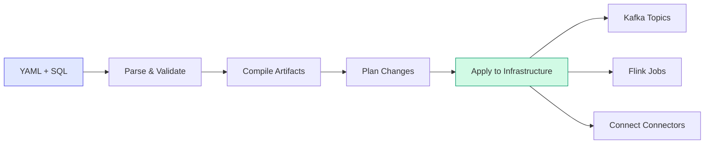

<div class="hero" markdown>

# streamt

**dbt for streaming** — Build declarative streaming pipelines with Kafka, Flink, and Connect

<span class="badge alpha">Alpha</span>

[Get Started](getting-started/quickstart.md){ .md-button .md-button--primary }
[View on GitHub](https://github.com/streamt/streamt){ .md-button }

</div>

---

## What is streamt?

**streamt** brings the beloved dbt workflow to real-time streaming. Define your streaming pipelines declaratively using YAML and SQL, then let streamt handle compilation, validation, and deployment to Kafka, Flink, and Kafka Connect.

```yaml title="stream_project.yml"
project:
  name: payments-pipeline
  version: "1.0.0"

sources:
  - name: payments_raw
    topic: payments.raw.v1
    description: Raw payment events from checkout service

models:
  - name: payments_validated
    materialized: flink
    description: Validated payments with fraud scores
    sql: |
      SELECT
        payment_id,
        customer_id,
        amount,
        CASE WHEN amount > 10000 THEN 'HIGH_RISK' ELSE 'NORMAL' END as risk_level
      FROM {{ source("payments_raw") }}
      WHERE status IS NOT NULL
```

---

## Why streamt?

<div class="grid" markdown>

<div class="card" markdown>

### :material-code-braces: Declarative First

Define **what** you want, not **how** to build it. Write YAML and SQL, let streamt generate Kafka topics, Flink jobs, and Connect configurations.

</div>

<div class="card" markdown>

### :material-source-branch: Built-in Lineage

Automatic dependency tracking from your SQL. See exactly how data flows from sources through transformations to downstream consumers.

</div>

<div class="card" markdown>

### :material-shield-check: Governance & Quality

Enforce naming conventions, partition requirements, and data classification. Run schema, sample, and continuous tests on your streams.

</div>

<div class="card" markdown>

### :material-terraform: Plan Before Apply

Review changes before deployment. See what topics will be created, which Flink jobs will be updated, and what connectors will be modified.

</div>

</div>

---

## How It Works



1. **Define** your sources, models, tests, and exposures in YAML
2. **Validate** syntax, references, and governance rules
3. **Compile** to infrastructure-specific artifacts
4. **Plan** to see what will change
5. **Apply** to deploy to Kafka, Flink, and Connect

---

## Quick Example

=== "Define Sources"

    ```yaml title="sources/payments.yml"
    sources:
      - name: payments_raw
        topic: payments.raw.v1
        description: Raw payment events from checkout
        owner: payments-team
        schema:
          registry: confluent
          subject: payments-raw-value
        columns:
          - name: payment_id
            description: Unique payment identifier
          - name: amount
            description: Payment amount in cents
            classification: internal
    ```

=== "Create Models"

    ```yaml title="models/payments_clean.yml"
    models:
      - name: payments_clean
        materialized: topic
        description: Cleaned and validated payments
        topic:
          name: payments.clean.v1
          partitions: 12
          config:
            retention.ms: 604800000
        sql: |
          SELECT
            payment_id,
            customer_id,
            amount,
            currency,
            created_at
          FROM {{ source("payments_raw") }}
          WHERE payment_id IS NOT NULL
            AND amount > 0
    ```

=== "Add Tests"

    ```yaml title="tests/payments_tests.yml"
    tests:
      - name: payments_schema_test
        model: payments_clean
        type: schema
        assertions:
          - not_null:
              columns: [payment_id, customer_id, amount]
          - accepted_values:
              column: currency
              values: [USD, EUR, GBP]

      - name: payments_sample_test
        model: payments_clean
        type: sample
        sample_size: 1000
        assertions:
          - range:
              column: amount
              min: 0
              max: 1000000
    ```

=== "Run CLI"

    ```bash
    # Validate your project
    streamt validate

    # See what will be deployed
    streamt plan

    # Deploy to infrastructure
    streamt apply

    # Run tests
    streamt test

    # View lineage
    streamt lineage
    ```

---

## Core Concepts

| Concept | Description |
|---------|-------------|
| **Source** | External data entry point (Kafka topic produced by another system) |
| **Model** | Transformation that creates new data streams |
| **Test** | Quality assertion (schema, sample, or continuous) |
| **Exposure** | Documentation of downstream consumers |
| **Materialization** | How a model is deployed (`topic`, `virtual_topic`, `flink`, `sink`) |

[Learn more about concepts →](concepts/overview.md)

---

## Materializations

streamt supports four materialization types:

| Type | Use Case | Infrastructure |
|------|----------|----------------|
| `topic` | Stateless transformations, filtering | Kafka topic |
| `virtual_topic` | Read-time filtering without storage | Conduktor Gateway |
| `flink` | Stateful processing, windowing, joins | Flink SQL job |
| `sink` | Export to external systems | Kafka Connect |

[Learn more about materializations →](reference/materializations.md)

---

## Installation

```bash
pip install streamt
```

Or with all optional dependencies:

```bash
pip install "streamt[all]"
```

[Full installation guide →](getting-started/installation.md)

---

## Community

- [GitHub Discussions](https://github.com/streamt/streamt/discussions) — Ask questions, share ideas
- [GitHub Issues](https://github.com/streamt/streamt/issues) — Report bugs, request features
- [Twitter](https://twitter.com/streamtdev) — Follow for updates

---

<div style="text-align: center; margin-top: 3rem;">

**Ready to build streaming pipelines the declarative way?**

[Get Started](getting-started/quickstart.md){ .md-button .md-button--primary }

</div>
