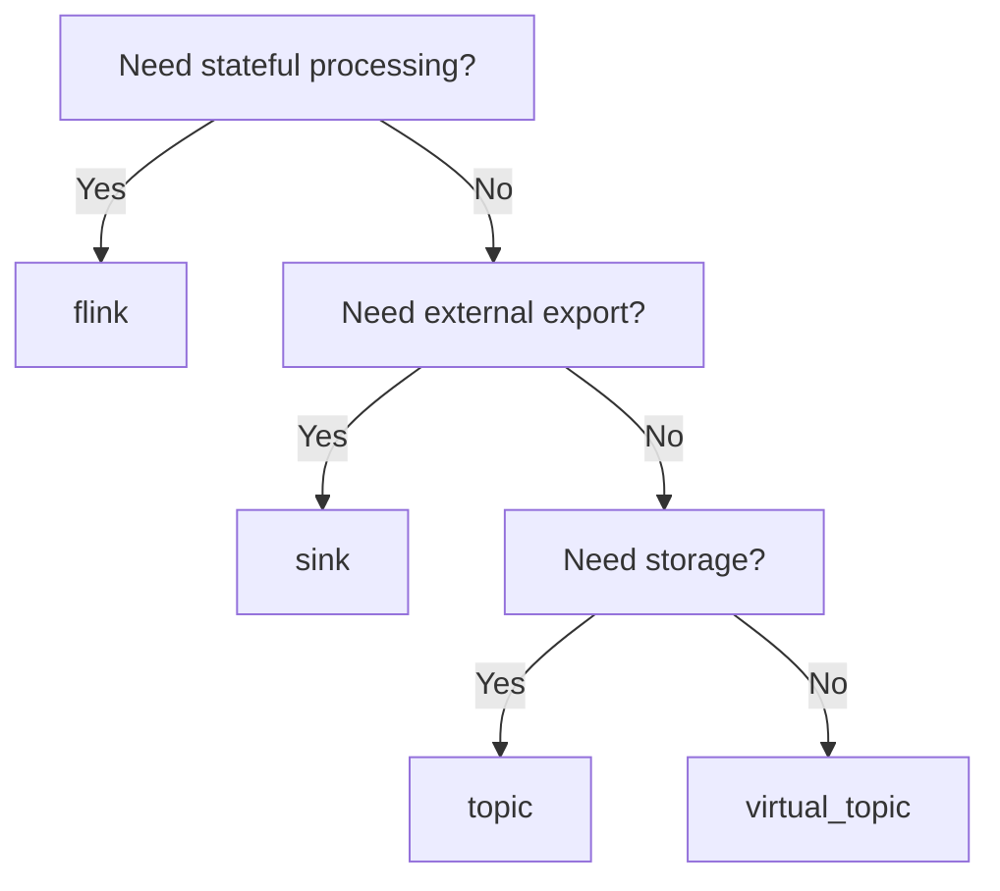

# Materializations

Materializations define how models are deployed. Each materialization type creates different infrastructure resources.

**IMPORTANT:** As of the latest version, the `materialized` field is **auto-inferred** from your SQL and configuration. You no longer need to specify it explicitly.

## Overview

| Materialization | Auto-Inferred When | Creates | Use Case |
|-----------------|---------------------|---------|----------|
| `virtual_topic` | Stateless SQL + Gateway configured | Gateway rule | Read-time filtering |
| `flink` | Stateful SQL or stateless without Gateway | Flink SQL job | Stateful processing |
| `flink` | `ML_PREDICT`/`ML_EVALUATE` functions | Confluent Flink job | ML inference |
| `sink` | Has `from:` without `sql:` | Connect connector | External exports |

## Smart SQL Detection

streamt uses **sqlglot** to parse your SQL and analyze whether it requires stateful processing:

### Stateless Patterns (can use Gateway)

- `WHERE` clauses with simple conditions
- Column projections (`SELECT a, b, c`)
- `CAST` and type conversions
- `COALESCE`, `CASE WHEN` (without aggregation)
- Simple function calls

### Stateful Patterns (require Flink)

- `GROUP BY` (aggregations)
- `JOIN` (stream-to-stream, temporal)
- `TUMBLE`, `HOP`, `SESSION` windows
- `OVER` clauses (window functions)
- `DISTINCT`
- `LAG`, `LEAD`, `ROW_NUMBER`, `RANK`

### Automatic Fallback

When Gateway is not configured but your SQL is stateless, streamt automatically falls back to Flink with a warning. This ensures your pipeline works regardless of infrastructure availability.

## Topic

Creates a Kafka topic with optional stateless transformations.

### When to Use

- Filtering data
- Field selection/projection
- Simple transformations
- Data validation
- Partitioning changes

### Configuration

**Simple example:**
```yaml
models:
  - name: orders_clean
    description: "Clean orders stream"
    key: order_id

    # materialized: topic (auto-inferred from simple SELECT)
    sql: |
      SELECT order_id, customer_id, amount
      FROM {{ source("orders_raw") }}
      WHERE amount > 0
```

**With advanced overrides:**
```yaml
models:
  - name: orders_clean
    description: "Clean orders stream"
    key: order_id

    sql: |
      SELECT order_id, customer_id, amount
      FROM {{ source("orders_raw") }}
      WHERE amount > 0

    # Only when overriding defaults:
    advanced:
      topic:
        name: orders.clean.v1          # Topic name
        partitions: 12                  # Partition count
        replication_factor: 3           # Replication
        config:                         # Topic configs
          retention.ms: 604800000       # 7 days
          cleanup.policy: delete
          min.insync.replicas: 2
```

### How It Works

1. Creates the Kafka topic with specified configuration
2. The SQL defines a filter/projection for consumers
3. Data flows through unchanged (SQL is documentation)
4. For actual filtering, use with Conduktor Gateway

### Topic Configuration Options

| Config | Type | Description |
|--------|------|-------------|
| `retention.ms` | long | Message retention time |
| `cleanup.policy` | string | `delete` or `compact` |
| `min.insync.replicas` | int | Minimum ISR |
| `compression.type` | string | `gzip`, `snappy`, `lz4`, `zstd` |
| `max.message.bytes` | int | Max message size |

---

## Virtual Topic

Creates a Gateway rule for read-time filtering without creating a physical topic.

!!! note "Requires Conduktor Gateway"
    Virtual topics require Conduktor Gateway to be configured.

### When to Use

- Multi-tenant data access
- Column-level security (masking)
- Read-time filtering
- No additional storage needed
- Access control views

### Configuration

```yaml
models:
  - name: orders_europe
    description: "European orders view (filtered)"

    # materialized: virtual_topic (auto-inferred from gateway config)
    from: orders_clean

    # Gateway configuration triggers virtual_topic materialization
    gateway:
      virtual_topic: orders.europe.virtual

    # Access control
    access:
      level: protected
      allowed_groups: [europe-team]

    # Security
    security:
      masking:
        - column: email
          policy: hash
        - column: phone
          policy: redact

    sql: |
      SELECT *
      FROM {{ ref("orders_clean") }}
      WHERE region = 'EU'
```

### How It Works

1. Creates a Gateway interceptor rule
2. Consumers read from virtual topic name
3. Gateway filters/masks data in real-time
4. No physical topic created
5. Reduces storage costs

### SQL Syntax Limitations

Gateway's VirtualSqlTopicPlugin supports limited SQL syntax for filtering:

| Supported | Not Supported |
|-----------|---------------|
| `=`, `<>` | `IN (...)` |
| `>`, `<`, `>=`, `<=` | `OR` |
| `REGEXP` | `IS NULL`, `IS NOT NULL` |
| `AND` | `LIKE`, `BETWEEN` |

**Workaround for IN**: Use `REGEXP` pattern matching:
```yaml
# Instead of: WHERE region IN ('US', 'EU')
# Use:
sql: |
  SELECT * FROM {{ source("orders") }}
  WHERE region REGEXP 'US|EU'
```

### Masking Policies

| Policy | Description | Example |
|--------|-------------|---------|
| `hash` | MD5/SHA256 hash | `abc@example.com` → `a1b2c3...` |
| `redact` | Replace with `***` | `John` → `***` |
| `partial` | Show partial | `555-1234` → `***-1234` |
| `null` | Replace with null | `secret` → `null` |
| `tokenize` | Replace with token | `4111...` → `tok_abc123` |

---

## Flink

Deploys a Flink SQL job for stateful stream processing.

### When to Use

- Windowed aggregations
- Stream-to-stream joins
- Complex event processing
- State management
- Exactly-once processing

### Configuration

**Simple example:**
```yaml
models:
  - name: hourly_revenue
    description: "Hourly revenue by region"

    # materialized: flink (auto-inferred from TUMBLE)
    sql: |
      SELECT
        TUMBLE_START(order_time, INTERVAL '1' HOUR) as window_start,
        TUMBLE_END(order_time, INTERVAL '1' HOUR) as window_end,
        region,
        SUM(amount) as total_revenue,
        COUNT(*) as order_count
      FROM {{ ref("orders_clean") }}
      GROUP BY
        region,
        TUMBLE(order_time, INTERVAL '1' HOUR)
```

**With advanced overrides:**
```yaml
models:
  - name: hourly_revenue
    description: "Hourly revenue by region"

    sql: |
      SELECT
        TUMBLE_START(order_time, INTERVAL '1' HOUR) as window_start,
        TUMBLE_END(order_time, INTERVAL '1' HOUR) as window_end,
        region,
        SUM(amount) as total_revenue,
        COUNT(*) as order_count
      FROM {{ ref("orders_clean") }}
      GROUP BY
        region,
        TUMBLE(order_time, INTERVAL '1' HOUR)

    # Only when overriding defaults:
    advanced:
      flink:
        parallelism: 8
        checkpoint_interval_ms: 60000
        state_backend: rocksdb

      flink_cluster: production

      topic:
        name: analytics.revenue.v1
        partitions: 6
```

### Flink SQL Features

#### Windowing

```sql
-- Tumbling window (fixed, non-overlapping)
GROUP BY TUMBLE(event_time, INTERVAL '5' MINUTE)

-- Hopping window (overlapping)
GROUP BY HOP(event_time, INTERVAL '1' MINUTE, INTERVAL '5' MINUTE)

-- Session window (gap-based)
GROUP BY SESSION(event_time, INTERVAL '10' MINUTE)
```

#### Joins

```sql
-- Stream-to-stream join (with time constraint)
SELECT o.*, c.name
FROM orders o
JOIN customers c
ON o.customer_id = c.id
AND o.order_time BETWEEN c.event_time - INTERVAL '1' HOUR
                     AND c.event_time + INTERVAL '1' HOUR

-- Stream-to-table join (lookup)
SELECT o.*, p.name as product_name
FROM orders o
JOIN products FOR SYSTEM_TIME AS OF o.order_time AS p
ON o.product_id = p.id
```

#### Built-in Functions

```sql
-- Time functions
CURRENT_TIMESTAMP
TIMESTAMPADD(HOUR, 1, event_time)
DATE_FORMAT(event_time, 'yyyy-MM-dd')

-- Aggregations
COUNT(*), SUM(amount), AVG(price)
MIN(ts), MAX(ts)
COLLECT(item)  -- Array aggregation

-- String functions
UPPER(name), LOWER(email)
SUBSTRING(str, 1, 5)
CONCAT(first, ' ', last)
```

#### ML Functions (Confluent Flink Only)

Confluent Cloud Flink supports ML inference directly in SQL:

```sql
-- Predict using a registered model
SELECT
  transaction_id,
  ML_PREDICT('FraudDetectionModel', amount, merchant_id) as prediction
FROM transactions

-- Evaluate model performance
SELECT
  ML_EVALUATE('FraudDetectionModel', actual_label, predicted_label) as metrics
FROM predictions
```

**Requirements:**

- Confluent Cloud Flink cluster (not open-source Flink)
- Model registered in Confluent's model registry
- `ml_outputs` field to declare output schema for type inference:

```yaml
- name: fraud_predictions
  sql: |
    SELECT transaction_id, ML_PREDICT('FraudModel', amount) as score
    FROM {{ ref("transactions") }}

  ml_outputs:
    FraudModel:
      score: DOUBLE
      confidence: DOUBLE
```

### Flink Settings Reference

All settings are nested under `advanced.flink`:

| Setting | Type | Default | Description |
|---------|------|---------|-------------|
| `parallelism` | int | 1 | Job parallelism |
| `checkpoint_interval_ms` | long | 60000 | Checkpoint interval (ms) |
| `state_backend` | string | hashmap | `hashmap` or `rocksdb` |
| `state_ttl_ms` | long | none | State TTL (ms) |

Cluster selection is at `advanced.flink_cluster`.

---

## Sink

Creates a Kafka Connect connector to export data externally.

### When to Use

- Data warehouse loading
- Database synchronization
- File storage (S3, GCS)
- Search index updates
- External API calls

### Configuration

**Simple example:**
```yaml
models:
  - name: orders_snowflake
    description: "Export orders to Snowflake"

    # materialized: sink (auto-inferred from 'from' without 'sql')
    from: orders_clean

    sink:
      connector: snowflake-sink
      config:
        snowflake.url.name: ${SNOWFLAKE_URL}
        snowflake.user.name: ${SNOWFLAKE_USER}
        snowflake.private.key: ${SNOWFLAKE_KEY}
        snowflake.database.name: ANALYTICS
        snowflake.schema.name: RAW
        snowflake.table.name: ORDERS
        tasks.max: 4
```

**With advanced overrides:**
```yaml
models:
  - name: orders_snowflake
    description: "Export orders to Snowflake"

    from: orders_clean

    sink:
      connector: snowflake-sink
      config:
        snowflake.url.name: ${SNOWFLAKE_URL}
        snowflake.user.name: ${SNOWFLAKE_USER}
        snowflake.private.key: ${SNOWFLAKE_KEY}
        snowflake.database.name: ANALYTICS
        snowflake.schema.name: RAW
        snowflake.table.name: ORDERS
        tasks.max: 4

        # Converters
        key.converter: org.apache.kafka.connect.storage.StringConverter
        value.converter: io.confluent.connect.avro.AvroConverter
        value.converter.schema.registry.url: ${SR_URL}

        # Behavior
        insert.mode: UPSERT
        pk.mode: record_key
        pk.fields: order_id

    # Only when overriding defaults:
    advanced:
      connect_cluster: production
```

### Supported Connector Types

| Type | Target | Connector Class |
|------|--------|-----------------|
| `snowflake-sink` | Snowflake | SnowflakeSinkConnector |
| `bigquery-sink` | BigQuery | BigQuerySinkConnector |
| `s3-sink` | Amazon S3 | S3SinkConnector |
| `gcs-sink` | Google Cloud Storage | GCSSinkConnector |
| `jdbc-sink` | PostgreSQL, MySQL | JdbcSinkConnector |
| `elasticsearch-sink` | Elasticsearch | ElasticsearchSinkConnector |
| `http-sink` | HTTP API | HttpSinkConnector |

### Snowflake Sink

```yaml
sink:
  connector: snowflake-sink
  config:
    snowflake.url.name: account.snowflakecomputing.com
    snowflake.user.name: STREAMT_USER
    snowflake.private.key: ${SNOWFLAKE_KEY}
    snowflake.database.name: ANALYTICS
    snowflake.schema.name: STREAMING
    snowflake.table.name: ORDERS
    buffer.count.records: 10000
    buffer.flush.time: 60
```

### S3 Sink

```yaml
sink:
  connector: s3-sink
  config:
    s3.bucket.name: my-data-lake
    s3.region: us-east-1
    topics.dir: streaming/orders
    flush.size: 1000
    rotate.interval.ms: 60000
    format.class: io.confluent.connect.s3.format.parquet.ParquetFormat
    partitioner.class: io.confluent.connect.storage.partitioner.TimeBasedPartitioner
    path.format: "'year'=YYYY/'month'=MM/'day'=dd/'hour'=HH"
    partition.duration.ms: 3600000
```

### JDBC Sink

```yaml
sink:
  connector: jdbc-sink
  config:
    connection.url: jdbc:postgresql://db:5432/analytics
    connection.user: ${DB_USER}
    connection.password: ${DB_PASSWORD}
    table.name.format: orders
    insert.mode: upsert
    pk.mode: record_key
    pk.fields: order_id
    auto.create: true
    auto.evolve: true
```

---

## Choosing a Materialization



| Scenario | Materialization |
|----------|-----------------|
| Filter + validate data | `topic` |
| Windowed aggregations | `flink` |
| Stream joins | `flink` |
| Multi-tenant views | `virtual_topic` |
| Column masking | `virtual_topic` |
| Export to Snowflake | `sink` |
| Export to S3 | `sink` |
| Simple projection | `topic` |
| Complex event processing | `flink` |
